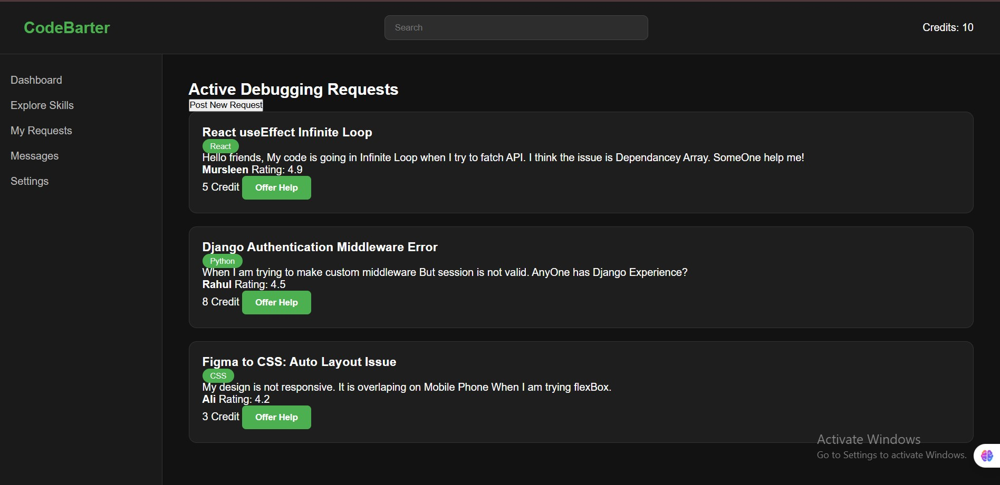
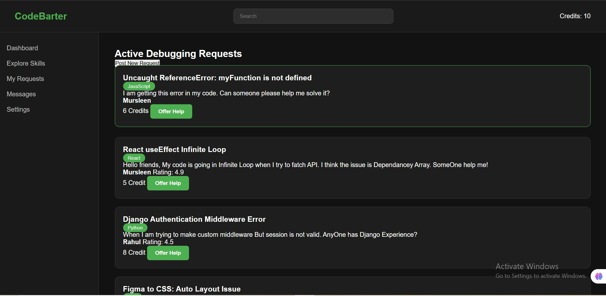
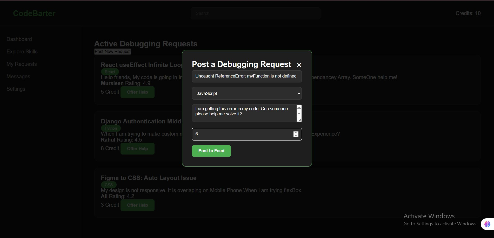

# CodeBarter 

CodeBarter is a debugging and skill-exchange platform UI built using HTML, CSS, and JavaScript.

## Project Preview

### Dashboard

### Post Request Modal

### New Request Added

##  Features

- Dark modern UI
- Debugging request feed
- Post new request modal
- Dynamic card creation using JavaScript
- Responsive sidebar layout

##  Tech Stack

- HTML5
- CSS3 (Flexbox, Dark Theme)
- Vanilla JavaScript (DOM Manipulation)

##  Project Structure

codebarter/
│
├── index.html
├── README.md
├── .gitignore
│
├── assets/
│   ├── css/
│   │   └── style.css
│   └── js/
│       └── script.js

##  Future Improvements

- Backend integration
- Authentication system
- Credit system logic
- Real-time messaging

---

Made with by [Mursleen]
